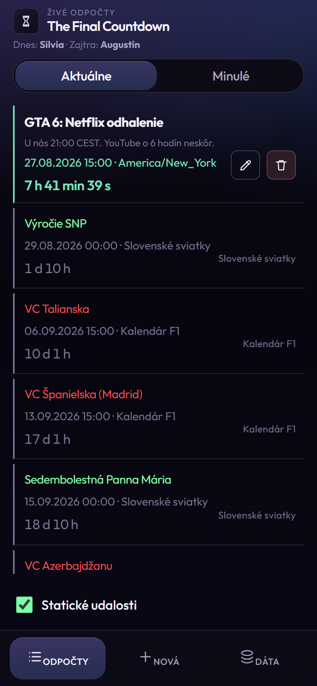
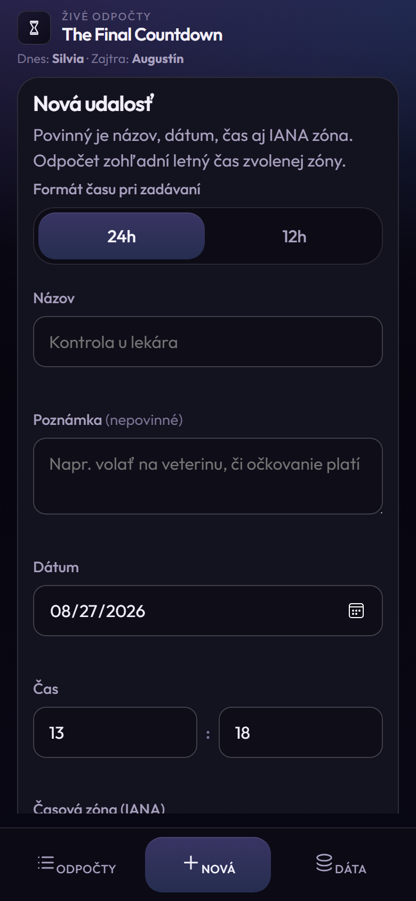
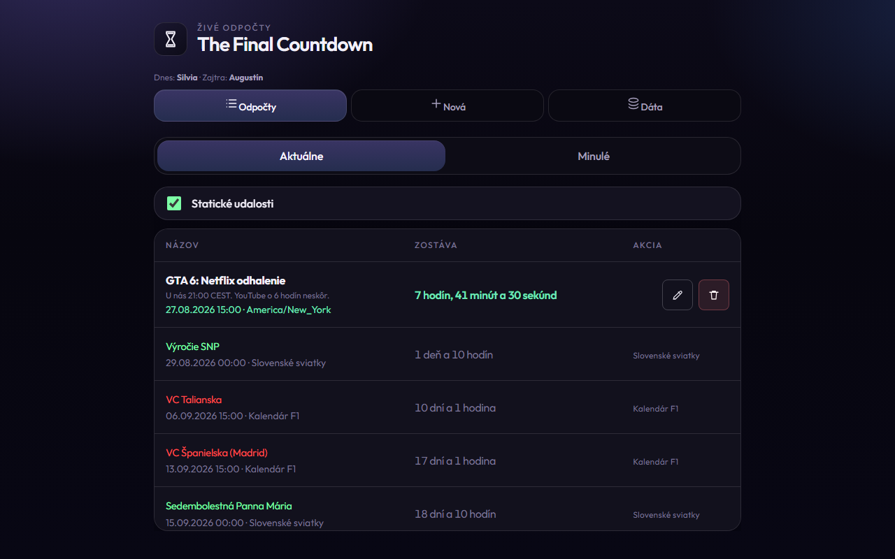

# The Final Countdown

A small **vanilla** countdown app (HTML, CSS, JS). It lists upcoming moments in one chronological feed: your own events (stored in this browser) plus optional static calendars from JSON. Time zones are IANA names; DST is applied for the zone you pick.

Live: [zrebec.github.io/thefinalcountdown](https://zrebec.github.io/thefinalcountdown)

This is **not** a full calendar. Holidays and F1 races sit in the same list as your doctor visit. Slovak name days are a one-line lookup under the title, not 365 extra cards.

## Screenshots

<p align="center">
  
  
</p>



## How a row is read

Every upcoming (and past) row uses the same layout. One example, then the rest follow.

**Example — your event (`GTA 6: Netflix odhalenie`)**

| Piece | What you see | Meaning |
| --- | --- | --- |
| Title | **GTA 6: Netflix odhalenie** (bold, default text color) | Event name. |
| Note | *U nás 21:00 CEST. YouTube o 6 hodín neskôr.* | Optional `note`. If empty, this line is omitted. |
| When | `27.08.2026 15:00 · America/New_York` (green on your events) | Wall date and time **in that IANA zone**, then the zone name. |
| Remaining | `7 h 41 min 39 s` (green; full Slovak sentence on desktop) | Live countdown to that instant. Past events show `+ …` on the **Minulé** tab. When the clock hits the moment, static holidays can show **TERAZ!** until midnight in their zone. |
| Left stripe | Green | Your event (mobile). |
| Actions | Pencil / trash | Edit or delete. Only your events. |

**Same pattern for a static row** (not repeated in a table):

- **Výročie SNP** — title color comes from the calendar in JSON (`#7dffa6` for Slovak holidays, `#ff4b4b` for F1).
- Date/time line is grey and ends with the calendar name (`Slovenské sviatky` / `Kalendár F1`).
- Remaining is grey.
- Left stripe on mobile is always grey for static rows.
- Right side shows the calendar name instead of edit/delete.

Uncheck **Statické udalosti** to hide every JSON calendar at once.

## Name days (not a calendar)

Under the title:

`Dnes: Silvia · Zajtra: Augustín`

That is today’s and tomorrow’s Slovak nameday, using **Europe/Bratislava** as the civil day — not the phone’s zone. It never enters the countdown list, Past, or iCal export.

## Controls

| Control | What it does |
| --- | --- |
| **Odpočty** | Chronological list. |
| **Aktuálne / Minulé** | Upcoming (and “now”) vs finished. Past is newest-first. |
| **Nová** | Create or edit an event. |
| **Dáta** | Export JSON, import JSON, export iCal. |
| **Statické udalosti** | Show or hide all bundled calendars. |

Install as a PWA from the browser (Add to Home Screen). Data stays in **this** browser’s `localStorage`.

## Add a new event

1. Open **Nová**.
2. Choose **24h** or **12h** for how you type the clock (AM/PM appears only in 12h).
3. Fill **Názov** (required).
4. Optional **Poznámka**.
5. **Dátum**, **Čas**, **IANA zóna** (search, e.g. `Bratislava` → `Europe/Bratislava`).
6. **Uložiť udalosť**.

The countdown uses that zone, including DST. A half-filled form is kept as a draft until you save or discard it.

## Working with JSON

There are three JSON stories. They do not mix.

### Your events (this browser)

Saved under `localStorage` key `tfc:events`. **Dáta → Export JSON** downloads them. Import replaces the stored list after a schema check (`version: 1`).

Shape of one user event:

```json
{
  "id": "string",
  "name": "string",
  "date": "YYYY-MM-DD",
  "time": "HH:MM",
  "timeZone": "IANA",
  "note": "optional; omit if empty"
}
```

iCal export is only **current** countdowns (future and TERAZ!). Optionally include static calendars with the checkbox on that card.

### Bundled calendars (`static-events.json`)

Hand-edited in the repo. Each group has `id`, `name`, `color` (hex), and `events[]` with the same date/time/zone fields as above. Invalid or missing `color` → grey title.

Today the file ships:

- `sk-holidays` — Slovak public holidays (title `#7dffa6`)
- `f1` — Formula 1 sessions (title `#ff4b4b`)

Only the current calendar year’s static dates are listed. Edit JSON, bump the `?v=` query on the fetch if you need caches to refresh.

### Namedays (`namedays-sk.json`)

Yearly lookup, **not** a static calendar group:

```json
{
  "version": "tfc-v20",
  "calendarName": "SK Meniny",
  "namedays": [
    { "month": "JAN", "day": 1, "name": "Nový rok" },
    { "month": "NOV", "day": 11, "name": "Martin, Maroš" }
  ]
}
```

`month` is `JAN`…`DEC`. Several names on one day are comma-separated. 29 Feb is included (Radomír) and skipped in non-leap years.

## Run locally

Any static server in this folder:

```bash
python -m http.server 8080
```

Then open `http://127.0.0.1:8080/`. Ports `8080` / `8081` skip the service worker so you always see fresh files.

## License

MIT. See [LICENSE](LICENSE).
